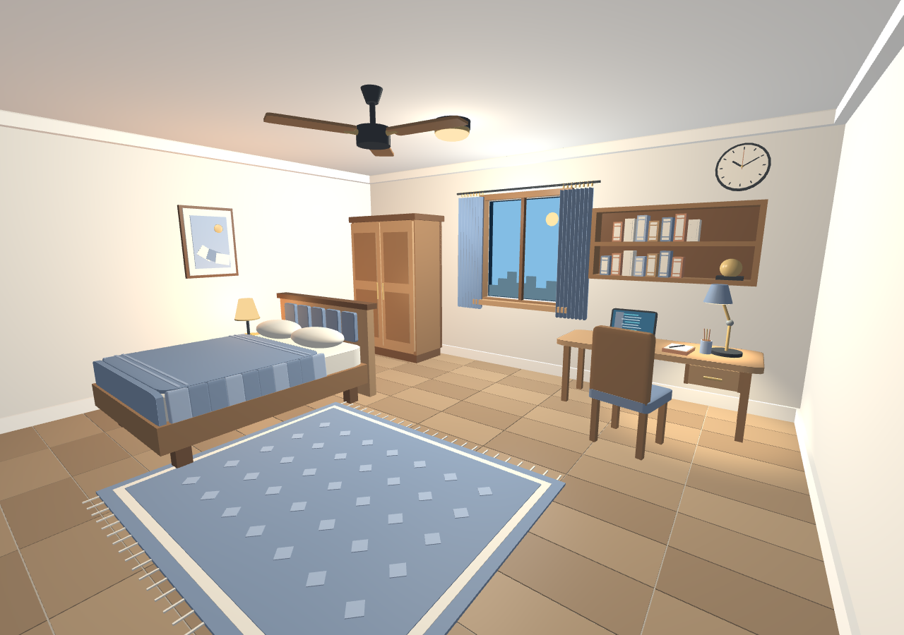
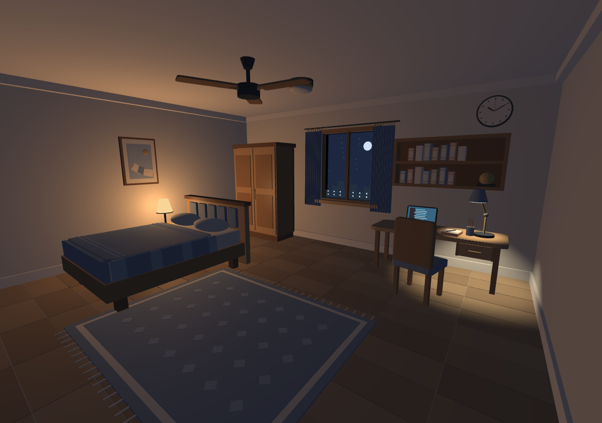

# My Smart Study Bedroom — Phase 2 Interactive Demo

The second half of the project extends the original `17936e1` Phase 1 demo with animation, object controls, multiple lights, weather and a day/night cycle. It keeps C++17, OpenGL 3.3 Core Profile, GLFW, GLAD and GLM, with no new dependencies.



## Build and run

From the project folder in PowerShell:

```powershell
.\build.bat
.\run.bat
```

The build script uses the existing MSYS2 UCRT64 GCC/CMake/Ninja toolchain. Dependencies are vendored in `external/`. You can also double-click the batch files. Keep the executable and its sibling `shaders/` directory together when copying the application.

## Controls

Click the window to focus it. The on-screen panel shows the controls and current light/environment state; **H** shows or hides the help panel.

| Input | Action |
| --- | --- |
| W / A / S / D | Move camera |
| Q / E | Move down / up |
| Tab + mouse | Capture/release pointer and look around |
| Mouse wheel | Zoom |
| **1 / 2 / 3** | **Flat / Gouraud / Phong shading** |
| V / R | Whole-room overview / reset camera |
| **F** | Fan on/off, with acceleration and coasting |
| **[ / ]** | Decrease/increase fan speed by one level |
| **O** | Open/close the room door |
| **C** | Open/close the folded curtains |
| **U** | Open/close both wardrobe doors |
| **J** | Slide the desk drawer |
| **M** | Open/close the laptop lid |
| **I** | Toggle laptop keyboard backlight; fades off as the lid closes |
| **L / B / K** | Ceiling / bedside / study light |
| **N** | Switch directly between day and night; stop automatic cycling |
| **T** | Enable/disable the automatic day/night cycle |
| **G** | Clear/rainy weather |
| **P** | Pause/resume all animation, environment time and camera tour |
| Space | Start/stop the 32-second camera tour |
| **Y** | Start/cancel the 109-second full project showcase |
| H | Show/hide the control panel |
| F12 | Save a BMP in `screenshots/` relative to the working directory |
| Escape | Exit |

The camera remains freely movable. Manual movement, mouse look, zoom, V or R cancels the tour. Pausing freezes motion; camera navigation and direct switches such as lights still work. Repeated key events do not retrigger toggles. Overview mode hides the front wall, ceiling and ceiling fixtures.

## Completed features

- **Animation:** fan rotor, hinged door, opening/folding curtains with gentle sway, three clock hands, wardrobe doors, desk drawer and laptop lid.
- **Lighting:** window daylight, ceiling and bedside point sources, and a downward study spotlight. All use ambient + diffuse + specular lighting with distance attenuation; the spotlight has a soft cone. Lamp geometry reflects each switch.
- **Environment:** a four-minute day/night cycle, direct day/night presets, sun/moon, stars, a small exterior skyline and moving rain. Closing curtains reduces window light; rain dims daylight.
- **Room detail:** floor pattern, padded headboard, two curved pillows, blanket drape/folds, rug border/pattern/fringe, wardrobe shelves and folded bedding, laptop keyboard/trackpad/screen graphics, books, study lamp and stationery.
- **Presentation:** built-in control/status panel, camera tour, repeatable captures and extended runtime verification.

Fan levels are Off (0), Low (120), Medium (240), High (360) and Max (480 degrees/second). Medium is the default. Each bracket press changes one level, clamped between Off and Max; `]` starts an off fan at Low. `F` switches power while remembering the last non-zero level. Speed changes keep the existing smooth acceleration/coasting at 120 degrees/second squared. The help panel shows the active level; paused motion applies the new target when resumed.

The laptop keyboard has cool white/cyan backlighting beneath its normally shaded keycaps. `I` remembers the backlight preference; the light fades between 15% and 35% lid opening and stays off when closed. Thin unlit boxes share the laptop parent transform and existing key grid, with a dimmer light bed underneath. No additional scene lights or bloom are used. In `src/objects/Study.cpp`, change `keyboardBacklight`'s RGB color or `backlightIntensity` to adjust the appearance.

The wall clock starts at 10:10 and advances one clock second per simulation second. The HUD time belongs to the accelerated environment cycle. Both stop with P. The plant remains permanently excluded.

## Suggested demonstration

Press **Y** for a complete automated demonstration in **109 seconds**. It covers every animated object, each light and all eight indoor-light combinations, fan speeds, keyboard backlighting, daylight/sunset/night/rain, clock motion, the existing camera tour and a frozen Flat/Gouraud/Phong comparison. **P** pauses/resumes the showcase; **Y** cancels it. Camera/object inputs wait until manual mode returns; H, F12 and Escape remain available. Completion or cancellation restores the previous camera, simulation, shading, tour and HUD settings. See [the full timeline, inventory and camera waypoints](docs/SHOWCASE.md).

1. Press **P**, then **1 / 2 / 3** to compare the same frame in each shading mode. The curved pillows, lamps and folded curtain show the differences.
2. Resume with **P**. Toggle **F**, **O**, **C**, **U**, **J** and **M** to show the moving parts; **V** gives an overview of the door.
3. Press **N** for night, **L** to turn off the ceiling light, then toggle **B / K** to compare the warm bedside light and desk spotlight.
4. Try **G** for rain and **T** for the day/night cycle. Use **Space** for a camera tour.



## Code tour

- `src/Simulation.*` owns motion targets, light switches, weather and time. `update(dt)` advances state; rendering never changes it.
- `src/main.cpp` handles input, camera tour, frame updates, shader selection and capture options.
- `src/Scene.cpp` places the room objects. `src/objects/` builds their parts using parent × translation × rotation × scale.
- `src/Lighting.cpp` uploads the same four light sources to all three shading programs.
- `src/Primitives.*` uploads six reusable meshes once: box, rounded box, sphere, cylinder, frustum and folded curtain.
- `src/Hud.*` batches a small built-in bitmap font into three overlay draws using a reusable buffer.
- `src/Verification.*` tests actual framebuffer output, animation and controls.

**Flat** shades triangle face normals and uses noninterpolated colors. **Gouraud** computes lighting per vertex and interpolates colors. **Phong** interpolates positions/normals and computes lighting per fragment. Every path uses the same four-light equation, inverse-transpose normals and one final gamma encoding.

## Verification and captures

```powershell
.\build\smart_study_bedroom.exe --verify
.\build\smart_study_bedroom.exe --view overview
.\build\smart_study_bedroom.exe --night --rain
.\build\smart_study_bedroom.exe --view study --mode phong --no-hud --capture docs/screenshots/study.bmp
```

Views: `interior`, `overview`, `bedroom`, `study`. Modes: `flat`, `gouraud`, `phong`. `--capture` renders one deterministic initial frame in a hidden real OpenGL window; `--no-hud` omits the overlay. `--shaders PATH` overrides the shader directory.

Verification also uses a hidden real OpenGL window. It checks independent controls against equally advanced comparison frames, all three lighting paths, frame-rate independence, limits, pause/resume, camera, resize, mesh reuse and a 30-second animated soak.

See [verification evidence](docs/VERIFICATION.md) and [completed project plan](PROJECT_PLAN.md). Screenshots: [overview](docs/screenshots/overview.png), [bedroom](docs/screenshots/bedroom.png), [study](docs/screenshots/study.png), [night](docs/screenshots/night.png), [rain](docs/screenshots/rain.png), [controls](docs/screenshots/controls.png).

## Rendering scope

This is a procedural educational OpenGL scene. It has no cast-shadow maps, image textures, transparent glass, physical cloth simulation, collision detection or exterior navigation level. Those optional additions are outside this completed Phase 2 milestone. Curtain folds, bedding, artwork and the environment use geometry and material colors.
