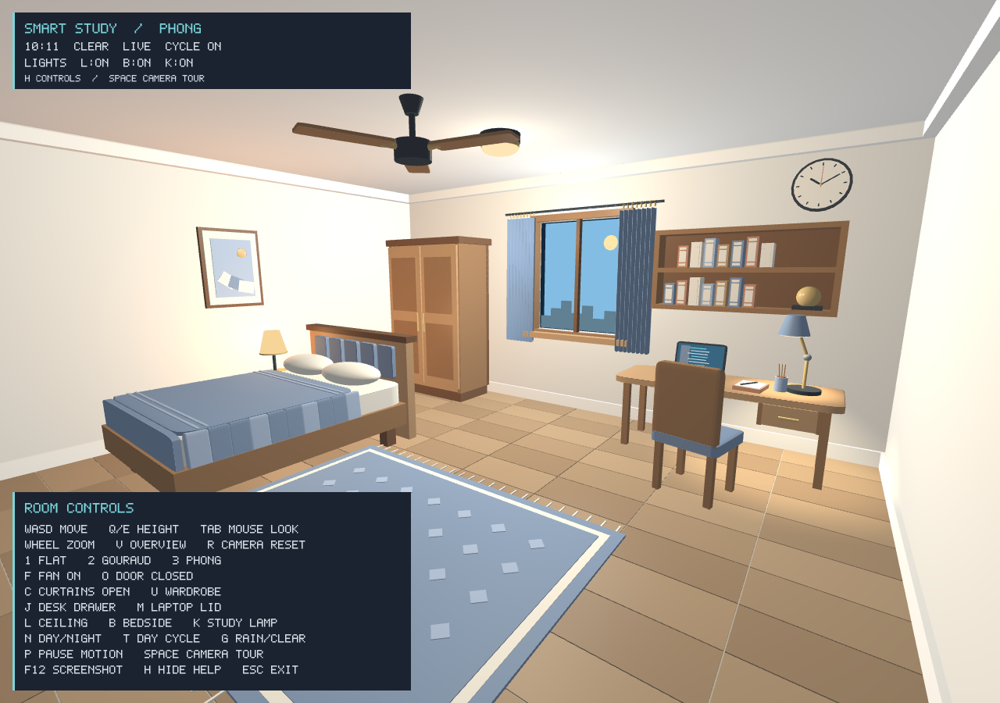

# Phase 2 verification

Verified on 2026-09-22 on Windows using the existing MSYS2 UCRT64 toolchain and AMD Radeon 780M Graphics.

Final run: **53 runtime assertions passed**, followed by a clean exit. The animated soak completed in 31.01 seconds; all six scene meshes were reused throughout.

## Build and rendering

- Release build passed with `-Wall -Wextra -Wpedantic`; no application compiler warnings.
- Real OpenGL 3.3 Core Profile context, driver 26.8.1.260810.
- All four shader programs compiled and linked; source shaders use GLSL 330 core.
- Six scene meshes upload once, including the folded curtain. No per-frame scene mesh creation.
- Default daytime interior: 527 scene draws; cutaway overview: 512. Weather and night skyline details add draws.
- HUD uses three additional batched draws and one reusable streamed buffer.
- No OpenGL errors reported; clean exit with code 0.

## Runtime checks

| Check | Result |
| --- | --- |
| 1/2/3 shading selection | Passed; same-state framebuffer images differ |
| Fan | Switching power changes rendered rotor; acceleration and stopping endpoints pass |
| Room door | Hinged geometry visibly opens |
| Curtain | Opening/closing visibly changes geometry and window lighting |
| Wardrobe | Both doors animate around outer hinges; interior visible |
| Desk drawer | Slides out with its contents and handle |
| Laptop | Lid folds around rear hinge |
| Ceiling, bedside and study lights | Each independently changes surface pixels in Flat, Gouraud and Phong |
| Day/night | Sky and room pixels change; direct presets stop auto-cycle |
| Automatic cycle | T resumes advancing environment time |
| Clock | Changing clock time moves rendered hands |
| Weather | Rain changes sky/daylight; streaks move in the window opening |
| Frame-rate independence | Motion agrees at 30 and 144 updates/second |
| Animation limits | Opening and closing positions clamp correctly |
| Midnight wrap | Environment hour and clock seconds wrap safely |
| Pause/resume | Frozen frame is identical after a 30-second simulation step; animation resumes |
| Camera tour | Moves between viewpoints; pause freezes it; reset and zoom cancel it |
| Repeated keys | Held toggle events do not retrigger |
| Camera controls | Delta-time movement, mouse capture, first-sample protection, pitch/zoom bounds pass |
| Overview/reset | Existing key dispatch preserved |
| HUD | Help toggle changes the overlay; full panel renders at 480x360 |
| Resize | 960x640, 480x360 and restored 1280x900 framebuffers pass |
| Animated render soak | Live scene renders for at least 30 real seconds and changes pixels |
| Resource reuse | Scene mesh upload count stays at six |
| GL errors / Escape | No GL error; Escape requests clean shutdown |

Interaction comparisons disable the HUD and advance both the baseline and changed scene by the same duration. That prevents unrelated clock/fan motion or status text from satisfying an interaction check. Light tests aim at receiving surfaces with the lamp models outside the view. Rain motion is checked close to the center of the window, away from the swaying curtains.

The 30-second soak is an offscreen diagnostic without swap/vsync; it is not a claim about presented frame rate. Native OS key delivery and minimize/restore have not been separately automated in this pass; the application input handlers, framebuffer resizing and rendered output were exercised directly.

## Visual review

Reviewed actual framebuffer captures for daytime interior, cutaway, bedroom/study, night/rain, lamps-only lighting, moving door, wardrobe, drawer, laptop, help panel and small-window layout. The PNG files are lossless conversions of application BMP captures.




## Reproduce

From the repository root:

```powershell
.\build.bat
.\build\smart_study_bedroom.exe --verify
```

The hidden window uses the real graphics driver and writes BMPs under `docs/screenshots/`. A graphics-capable Windows session is required.

Individual captures:

```powershell
.\build\smart_study_bedroom.exe --view overview --no-hud --capture docs/screenshots/overview.bmp
.\build\smart_study_bedroom.exe --view bedroom --no-hud --capture docs/screenshots/bedroom.bmp
.\build\smart_study_bedroom.exe --view study --no-hud --capture docs/screenshots/study.bmp
.\build\smart_study_bedroom.exe --night --rain --no-hud --capture docs/screenshots/night-rain.bmp
```

## Scope limits

There are no cast shadows, image textures, transparent-glass compositing, camera collisions or physical cloth simulation. Window scenery is confined to the window; the open door reveals the scene background. The wall clock is a demonstration clock starting at 10:10, independent of the accelerated environment clock. The plant remains absent.
