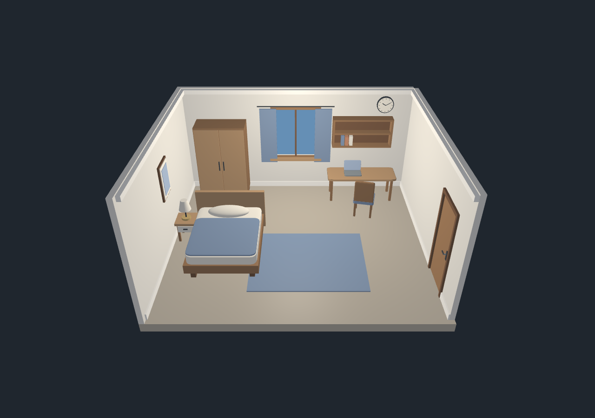

# Phase 1 Lite Demo verification

Verified on 2026-09-21 after simplifying the existing project. These results and the screenshots describe the Lite Demo, replacing the previous richer-scene report.

## Runtime and build

- Windows, GCC 16.2.0, CMake 4.4.3 and Ninja 1.13.2.
- AMD Radeon 780M Graphics; OpenGL 3.3.0 Core Profile Context, driver 26.8.1.260810.
- Driver-reported GLSL 4.60; every application shader still explicitly uses GLSL 330 core.
- Release rebuild passed with no application compiler warnings.
- All four existing shader programs compiled and linked.
- Five shared primitive meshes, reduced from eight.
- 116 draws per interior frame, reduced from 610; 101 in the overview.
- No new dependencies, architecture or controls.

## Current checks

| Check | Result |
| --- | --- |
| Simplified source build | Passed |
| Same-camera 1/2/3 shader comparison | All three rendered images differ; modes remain functional |
| Camera movement | Delta-time travel and matching travel across frame steps passed |
| Mouse look | Orientation update and first-sample jump prevention passed |
| Camera bounds | Zoom and pitch limits passed |
| Overview and reset | Correct key dispatch; repeated toggle events ignored |
| Resize | Framebuffer changed to 960x640 and back; rendering passed |
| Static scene | First and last frame pixels identical across the 30-second render soak |
| Mesh reuse | Upload count stayed at five during mode switches and navigation |
| OpenGL errors | None reported at verification completion |
| Exit | Escape requested shutdown; process exited with code 0 |
| Visual review | Interior, overview, bedroom and study views checked |
| Removed code | No plant, dustbin, study-lamp, spotlight or unused fabric/art mesh implementation remains in src/shaders |
| Kept geometry | Core room objects present; one frame, three books, four-legged chair, base/screen laptop and plain curtain/rug |
| Lighting scope | One fixed source plus ambient; no spotlight, attenuation, lamp source or light controls |

The existing check ran at least 30 seconds and synchronized outstanding GPU work before comparing the final frame. No presented-FPS claim is made from this offscreen diagnostic.

## Reproduce

From the project root:

```powershell
.\build.bat
.\build\smart_study_bedroom.exe --verify
```

The verification window is invisible but uses a real OpenGL context. It exercises the existing input handlers and saves BMPs under `docs/screenshots/`. PNGs for review were refreshed from the actual framebuffer captures.

Native window event delivery/minimize/restore and missing-shader diagnostics were checked during the earlier full-scene implementation. They were not separately rerun for this content-only simplification; their underlying window/shader-loading code is unchanged. The checks in the table above were rerun for the Lite Demo.

## Deliberate limits and future work

The camera has no collision. There are no shadows, textures, transparent glass, animation, weather, day/night cycle or dynamic light controls. Flat mode deliberately shows per-triangle changes on large surfaces. The bedside lamp and ceiling fixture are static models; the window backdrop is a fixed unlit color.

Later requests may extend the richer objects or lighting. The plant is permanently excluded from the project.


